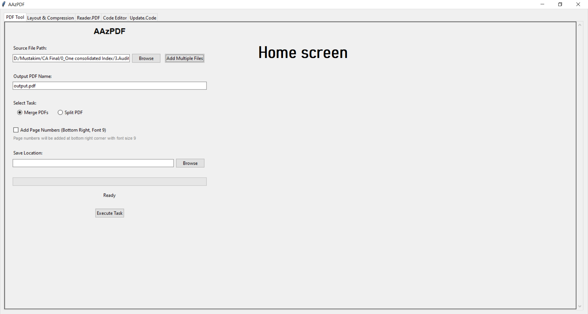
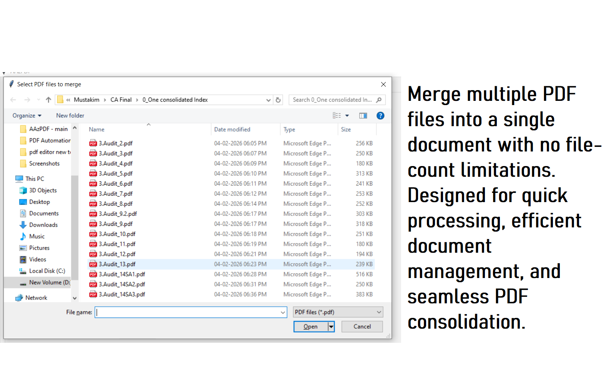
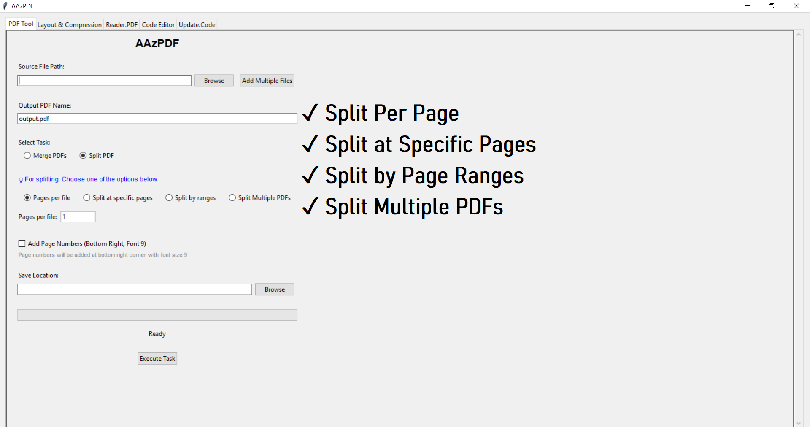

# AAzPDF

## Overview

AAzPDF is a Python-based PDF productivity suite designed to simplify document management and editing workflows. The application combines PDF merging, splitting, reading, annotation, page management, and editing features within a single desktop interface.

## Key Features

### PDF Management
- Merge multiple PDF files into a single document
- Split PDFs by pages, specific page numbers, or custom ranges
- Split multiple PDF files in a single operation
- Add page numbers during processing

### PDF Reader
- Open and navigate PDF documents
- Zoom in and out for detailed viewing
- Page navigation controls
- Light and Dark viewing modes

### PDF Editor
- Add text annotations
- Insert shapes and highlights
- Customize font styles and colors
- Configure fill and border colors
- Add blank pages
- Replace existing pages

### Productivity Benefits
- Reduces manual PDF handling effort
- Supports large document workflows
- Combines multiple PDF utilities into one application
- Provides an intuitive desktop interface

## Technologies Used

- Python
- Tkinter
- PyMuPDF (fitz)
- PyPDF2
- Pillow (PIL)
- ReportLab

## Project Structure

AAzPDF_Editor.py
- PDF Reader, Annotation, and Editing Tool

AAzPDF_Manager.py
- PDF Merge, Split, and Management Tool

## Screenshots

### Editor Interface
.png)

### Editor Dark Mode
.png)

### PDF Manager

### Merge Function

### Split Function

## Future Enhancements

- OCR Integration
- Password-Protected PDF Support
- Batch Processing Improvements
- Advanced Annotation Tools
- Cloud Storage Integration
